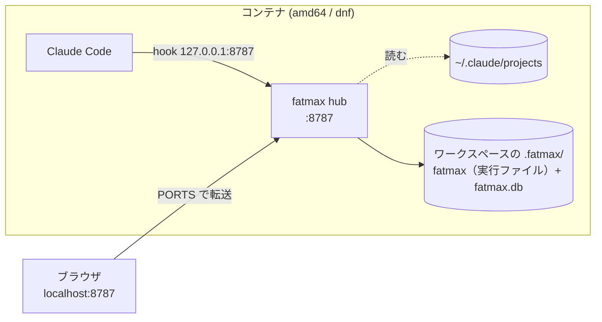

# コンテナ1つで完結（amd64 / dnf 系）

Claude Code を **Docker コンテナ1つ**で動かしていて、そのコンテナだけ見る場合の手順です。
**ハブを起動するだけ**で、ウォッチャー（ウォッチャー）も手元の準備も要りません。

**CPU は amd64（x86_64）**、コンテナは **dnf 系**（Amazon Linux / Fedora / RHEL）を前提に
書いてあります。いま配っているのは `0.1.127` です。
やめ方は [アンインストール](#アンインストール) にあります。

- 複数の EC2 に散らばったコンテナを1画面に集めたい → **[複数 EC2 × 複数コンテナ](INSTALL-ec2.md)**
- コンテナを使わない一般的な入れ方 → **[install](INSTALL.md)**

## 前提

**VS Code の Dev Containers 拡張でコンテナの中を開いて開発できていること。**
Claude Code もそのコンテナの中で動いている状態から始めます。

以下のコマンドは**すべてコンテナの中のターミナル**（VS Code のターミナル）で叩きます。
手元に置くものは1つもありません。

---



**ウォッチャーが要ります**（宛先はウォッチャー1本です）。実行中に差し込んだ指示（`~/.claude/projects`）も
同じコンテナなのでハブ自身が読めます。**Claude Code と同じユーザーで動かす**のが条件です。

## 1. 実行ファイルを置く

**ワークスペースの中の `.fatmax/` に置きます。** コンテナの中（`/usr/local/bin` など）に
置くと **Rebuild で消えます**。ワークスペースのフォルダだけは手元のディスクを
マウントしたものなので、作り直しても残ります。**記録（DB）も同じ場所に置きます**
（3. で指定）。

VS Code のターミナルは**ワークスペースの直下**で開きます。そこで叩いてください。

```sh
mkdir -p .fatmax
curl -fsSL https://nodesi-jp.github.io/fatmax/bin/fatmax-linux-x86_64 -o .fatmax/fatmax
chmod +x .fatmax/fatmax
ln -sf "$PWD/.fatmax/fatmax" /usr/local/bin/fatmax     # `fatmax` と打てるようにする
```

- **`/workspaces/.fatmax` ではありません。** マウントされているのは
  `/workspaces/<フォルダ名>` **だけ**で、その隣はコンテナの中です（作り直すと消えます）
- **`.gitignore` に足してください。** DB には**会話の中身がそのまま入ります**。
  実行ファイルも 4.7MB あります

  ```sh
  echo '/.fatmax/' >> .gitignore
  ```

- 最後の `ln -sf` だけはコンテナの中に作るので Rebuild で消えます。
  実体は残っているので張り直すだけです（後述の `postStartCommand` がやります）
- **新しい版に上げるときは消して取り直します。** 残るということは、
  黙って古いまま使い続けるということでもあります

  ```sh
  rm .fatmax/fatmax && curl -fsSL https://nodesi-jp.github.io/fatmax/bin/fatmax-linux-x86_64 -o .fatmax/fatmax && chmod +x .fatmax/fatmax
  ```

## 2. 画面に出る名前を決める

`~/.claude/fatmax-host` の**1行目がそのまま画面に出ます。** 好きな名前にしてください。

```sh
mkdir -p ~/.claude && echo 'dev-1' > ~/.claude/fatmax-host
```

**必ず置いてください。** dnf 系のイメージには `hostname` コマンドが入っていないので、
無いと**名前が空のまま**画面に並びます（実測: `amazonlinux:2023`）。

**あとから書き換えてもかまいません。** 送るたびに読み直すので、
ハブや Claude Code の再起動は要りません。次のイベントから新しい名前になります。

```sh
echo 'api-dev' > ~/.claude/fatmax-host     # いつでも
```

## 3. ハブを起動する

**`--db` を必ず付けます。** 既定は `~/.fatmax/fatmax.db` で、そこはコンテナの中なので
**作り直すと記録が丸ごと消えます**。1. で作った `.fatmax/` を指してください。

```sh
nohup fatmax hub --db "$PWD/.fatmax/fatmax.db" > /tmp/fatmax-hub.log 2>&1 &
```

**どこに書いているかは 6. の `fatmax status` に出ます。** `記録` の行が
`/workspaces/…/.fatmax/fatmax.db` になっていることを見てください
（`$PWD` がワークスペースの直下でないと、黙って別の場所に作ります）。

## 4. hook を入れる

**Claude Code を開いているディレクトリで**実行します。

```sh
curl -fsSL http://127.0.0.1:8787/setup.sh | sh
```

`~/.claude/settings.json` に hook と statusLine が入るだけで、置くファイルはありません。
**このあと Claude Code を再起動してください。**

- **2箇所に入れないこと。** user と project の両方にあると足し算で読まれ、
  **全イベントが2回届いて回数もコストも倍**になります

## 4.5. ウォッチャーを動かす

**宛先はウォッチャー1本です**（ハブ直はありません）。同じコンテナで動かしてください。

```sh
.fatmax/fatmax watch &
```

動かすまで、記録は `~/.fatmax/spool` に溜まるだけでハブへは上がりません。**消えはしません**
—— 動かせば溜まっていたぶんがまとめて流れます。

**Claude Code と同じユーザーで動かすこと。** 実行中に差し込んだ指示と Esc の印は
`~/.claude/projects` を読んで拾うので、別ユーザーだと読めません。

## 5. 画面を開く

**VS Code の PORTS タブ**（ターミナルの隣）に `8787` が出ています。
3. でハブが待ち受けを始めた時点で、Dev Containers が**自動で転送**します。

その行の**🌐 をクリックするだけ**です。手元のブラウザで `http://localhost:8787/` が開きます。

- 出ていなければ「ポートの転送」で `8787` を足します
- 毎回確実に出したいなら `devcontainer.json` に `"forwardPorts": [8787]`

**コンテナを作り直す必要はありません。**

## 6. 確認

```sh
fatmax status
```

こう出れば成立です。

```
✓ ハブ        動いています  http://127.0.0.1:8787
⚠ ウォッチャー        動いていません（記録はディスクに溜まり、ハブへ上がりません）
✓ hook        入っています（ユーザ全体）
✓ transcript  読めています（実行中に差し込んだ指示も出ます）
```

`－ ウォッチャー` は**このパターンでは正常**です。要らないので。

## コンテナを作り直したとき

**Dev Containers: Rebuild Container** をしても、`.fatmax/` はワークスペースの中なので
**実行ファイルも記録も残ります**。消えるのはコンテナの中に作ったものだけです。

| 残るもの | 消えるもの |
|---|---|
| `.fatmax/fatmax`（実行ファイル） | `/usr/local/bin/fatmax` の symlink |
| `.fatmax/fatmax.db`（記録） | `~/.claude/fatmax-host`（画面に出る名前） |
| | `~/.claude/settings.json` の hook（＝ 4.） |

消えるぶんを毎回やり直したくないなら `devcontainer.json` に入れておきます。

```json
"postStartCommand": "mkdir -p .fatmax ~/.claude && { [ -x .fatmax/fatmax ] || { curl -fsSL https://nodesi-jp.github.io/fatmax/bin/fatmax-linux-x86_64 -o .fatmax/fatmax && chmod +x .fatmax/fatmax; }; } && ln -sf ${containerWorkspaceFolder}/.fatmax/fatmax /usr/local/bin/fatmax && echo dev-1 > ~/.claude/fatmax-host && (nohup fatmax hub --db ${containerWorkspaceFolder}/.fatmax/fatmax.db > /tmp/fatmax-hub.log 2>&1 &)"
```

> **`postCreateCommand` ではなく `postStartCommand`。** postCreate は作った1回だけなので、
> コンテナを止めて開き直すとハブが上がりません。

- **実行ファイルは「無ければ取る」。** 毎回上書きすると、走っているものを差し替えて
  しまううえ、Rebuild のたびにネットワークを待たされます
- **hook は入りません。** ハブが待ち受けるまで待つ必要があり、
  一行に混ぜると競争になります。Rebuild のあとに 4. を叩き直してください
  （`fatmax status` の `hook` が `✗` なら、それです）

---

## うまくいかないとき

| 症状 | 見るところ |
|---|---|
| 画面に名前が出ない・空になる | `~/.claude/fatmax-host` が無い。**dnf 系には `hostname` コマンドがありません** |
| 画面が開けない | VS Code の PORTS に `8787` が無い。または 3. のハブが上がっていない |
| 昨日まで届いていたのに止まった | コンテナの IP が変わって、hook に焼かれた宛先が古い。`setup.sh` を叩き直す |
| 回数とコストが倍 | hook が2箇所（user と project）に入っています。片方を `--uninstall` |
| 実行中に差し込んだ指示が出ない | `fatmax status` の `⚠ ~/.claude/projects が読めません`。**Claude Code と同じユーザー**でハブを動かす |
| 作り直したら過去のコストも会話も消えた | `--db` を付けずに起動しています。`fatmax status` の `記録` が `~/.fatmax/…` ならそれです |
| `fatmax: command not found` | symlink はコンテナの中なので Rebuild で消えます。1. の `ln -sf` だけ張り直す |
| 版が古いまま | `.fatmax/fatmax` は**残る**ので上がりません。1. の最後で消して取り直す |
| 接続が止まらない・ポートが枯れる | ハブとウォッチャーの版がズレていると1秒ごとに繋ぎ直します。両方を 0.1.127 以上へ。手順は [INSTALL-ec2.md](INSTALL-ec2.md) の「接続が止まらない・ポートが枯れる（調べ方）」 |

---

## アンインストール

**コンテナを捨てても消えません。** 実行ファイルも記録もワークスペースの中（`.fatmax/`）に
置いてあるためです。外すときは:

```sh
curl -fsSL http://127.0.0.1:8787/setup.sh | sh -s -- --uninstall
pkill -f 'fatmax hub' || true
rm -f /usr/local/bin/fatmax ~/.claude/fatmax-host
rm -f .fatmax/fatmax                                   # 記録（fatmax.db）は残ります
```

`devcontainer.json` に `postStartCommand` を足したなら、そこからも消してください。
残っていると次の Rebuild で取り直して起動します。

`--local` で入れたなら、**入れたディレクトリで** `sh -s -- --uninstall --local` です
（外す場所も入れたときと同じ指定で選びます）。fatmax が書いた hook と statusLine
だけを外すので、あなた自身の設定は残ります。

記録を消すなら `rm -rf .fatmax`（`--db` で場所を変えたならそちら）。
**残したいなら消さないでください** —— 日別の集計を生イベントから積み直しているので、
消すと過去のコストも会話も戻りません。

---

[README に戻る](README.md)
