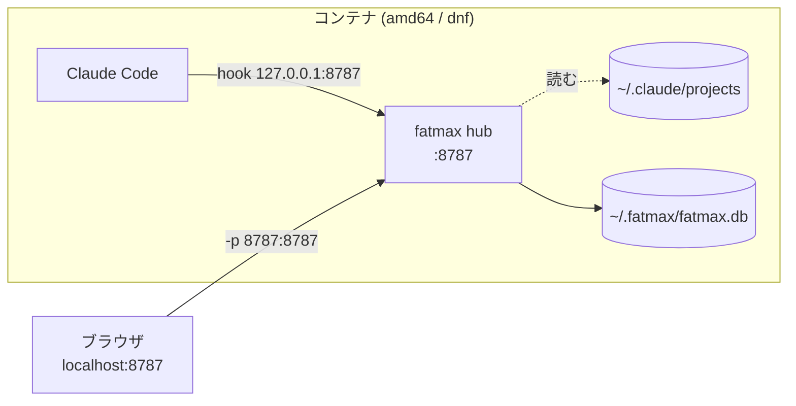

# コンテナ1つで完結（amd64 / dnf 系）

Claude Code を **Docker コンテナ1つ**で動かしていて、そのコンテナだけ見る場合の手順です。
**ハブを起動するだけ**で、中継（リレー）も手元の準備も要りません。

**CPU は amd64（x86_64）**、コンテナは **dnf 系**（Amazon Linux / Fedora / RHEL）を前提に
書いてあります。いま配っているのは `0.1.17` です。
やめ方は [アンインストール](#アンインストール) にあります。

- 複数の EC2 に散らばったコンテナを1画面に集めたい → **[複数 EC2 × 複数コンテナ](INSTALL-ec2.md)**
- コンテナを使わない一般的な入れ方 → **[install](INSTALL.md)**

**dnf 系のイメージには `hostname` コマンドが入っていません。** 名前を決めるファイルを置かないと、
画面に出る名前が**空**になります（実測: `amazonlinux:2023`）。**必ず置いてください。**
この1行目が画面に出る名前です。**送るたびに読み直す**ので、書き換えても再起動は要りません。

---



**リレーは要りません。** hook はハブへ直接届き、実行中に差し込んだ指示（`~/.claude/projects`）も
同じコンテナなのでハブ自身が読めます。**Claude Code と同じユーザーで動かす**のが条件です。

## 1. 実行ファイルを置く

```sh
curl -fsSL https://nodesi-jp.github.io/fatmax/bin/fatmax-linux-x86_64 -o /usr/local/bin/fatmax
chmod +x /usr/local/bin/fatmax
mkdir -p ~/.claude && echo 'dev-1' > ~/.claude/fatmax-host
```

## 2. ハブを起動する

```sh
nohup fatmax hub > /tmp/fatmax-hub.log 2>&1 &
```

記録は `~/.fatmax/fatmax.db` です。**コンテナを作り直すと消えます。**
残すならマウントした場所を指してください。

```sh
nohup fatmax hub --db /workspaces/.fatmax/fatmax.db > /tmp/fatmax-hub.log 2>&1 &
```

## 3. hook を入れる

**Claude Code を開いているディレクトリで**実行します。

```sh
curl -fsSL http://127.0.0.1:8787/setup.sh | sh
```

`~/.claude/settings.json` に hook と statusLine が入るだけで、置くファイルはありません。
**このあと Claude Code を再起動してください。**

- 既定は `--user`（そのコンテナの全プロジェクト）です。1つのプロジェクトに絞るなら、
  そのディレクトリで `sh -s -- --local`。**書き先が `$PWD/.claude/settings.local.json` なので、
  場所を間違えると「インストールしました」と出たまま1件も届きません**
- **2箇所に入れないこと。** user と project の両方にあると足し算で読まれ、
  **全イベントが2回届いて回数もコストも倍**になります

> **hook の宛先には、コンテナの IP が書かれます**（`127.0.0.1:8787` で叩いても
> `http://172.17.0.2:8787` になります。他のマシンへ配る設定に localhost が入る事故を防ぐため）。
> `~/.claude` をマウントして使い回している場合、**コンテナの IP が変わった時点で届かなくなります**。
> そのときは 3. をやり直してください。

## 4. 画面を開く

**8787 をホストへ出します。**

```sh
docker run -p 8787:8787 ...
```

devcontainer なら PORTS タブ、compose なら `ports: ["8787:8787"]` です。
**コンテナを作るときにしか効きません**ので、出ていなければ作り直してください。
出せたら、ホスト側のブラウザで `http://localhost:8787/` です。

## 5. 確認

```sh
fatmax status
```

こう出れば成立です。

```
✓ ハブ        動いています  http://127.0.0.1:8787
－ 中継        動いていません（hook はハブへ直接飛びます）
✓ hook        入っています（ユーザ全体）
✓ transcript  読めています（実行中に差し込んだ指示も出ます）
```

`－ 中継` は**このパターンでは正常**です。要らないので。

## コンテナを作り直したとき

`/usr/local/bin/fatmax` も記録も消えるので、**1. から**やり直します。
毎回やりたくないなら devcontainer に入れておきます。

```json
"postStartCommand": "sh -c 'mkdir -p ~/.claude && echo dev-1 > ~/.claude/fatmax-host && curl -fsSL https://nodesi-jp.github.io/fatmax/bin/fatmax-linux-x86_64 -o /tmp/fatmax && chmod +x /tmp/fatmax && (nohup /tmp/fatmax hub >/tmp/fatmax-hub.log 2>&1 &)'"
```

> **`postCreateCommand` ではなく `postStartCommand`。** postCreate は作った1回だけなので、
> コンテナを止めて開き直すとハブが上がりません。

---

## トークルームも使う場合（任意）

セッションどうしを会話させるなら、**会話担当エージェント**を入れます。
hook とは別物で、**入れなくても記録は取れます**。

```sh
mkdir -p ~/.claude/agents
curl -fsSL http://127.0.0.1:8787/agents/room-talker.md -o ~/.claude/agents/room-talker.md
```

**宛先は `setup.sh` を叩いたときと同じ**です。入れたら **Claude Code を開き直してください。**

- **部屋に入れるコンテナそれぞれに入れます。** `~/.claude` はコンテナごとに別です
- 一覧と Windows 版の入れ方は `http://127.0.0.1:8787/agents` にあります

---

## うまくいかないとき

| 症状 | 見るところ |
|---|---|
| 画面に名前が出ない・空になる | `~/.claude/fatmax-host` が無い。**dnf 系には `hostname` コマンドがありません** |
| 画面が開けない | `8787` をホストへ出していない。**コンテナを作るときにしか指定できません** |
| 昨日まで届いていたのに止まった | コンテナの IP が変わって、hook に焼かれた宛先が古い。`setup.sh` を叩き直す |
| 回数とコストが倍 | hook が2箇所（user と project）に入っています。片方を `--uninstall` |
| 実行中に差し込んだ指示が出ない | `fatmax status` の `⚠ ~/.claude/projects が読めません`。**Claude Code と同じユーザー**でハブを動かす |
| 部屋に入れない | `~/.claude/agents/room-talker.md` がありません（[上](#トークルームも使う場合任意)） |

---

## アンインストール

**コンテナを捨てるだけなら何もしなくて構いません**（中にしか置いていないので）。
`~/.claude` をマウントしている・使い続ける場合は:

```sh
curl -fsSL http://127.0.0.1:8787/setup.sh | sh -s -- --uninstall
pkill -f 'fatmax hub' || true
rm -f /usr/local/bin/fatmax ~/.claude/fatmax-host
```

`--local` で入れたなら、**入れたディレクトリで** `sh -s -- --uninstall --local` です
（外す場所も入れたときと同じ指定で選びます）。fatmax が書いた hook と statusLine
だけを外すので、あなた自身の設定は残ります。

記録を消すなら `rm -rf ~/.fatmax`（`--db` で場所を変えたならそちら）。
**残したいなら消さないでください** —— 日別の集計を生イベントから積み直しているので、
消すと過去のコストも会話も戻りません。

---

[README に戻る](README.md)
