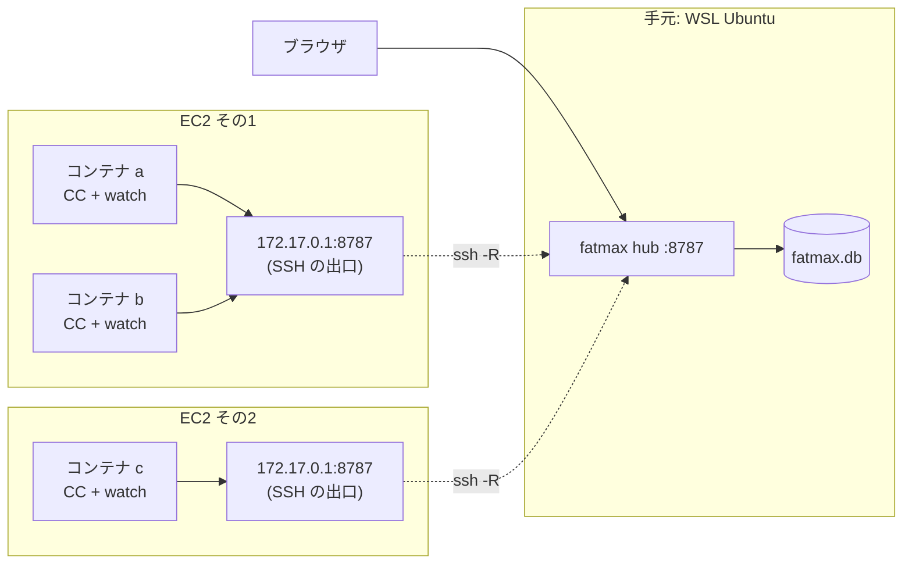

# 複数 EC2 × 複数コンテナ（amd64 / dnf 系）

**手元の WSL Ubuntu にハブ**を置き、**複数の EC2 で動いている複数のコンテナ**を
1画面に集める手順です。各コンテナには**ウォッチャー**を入れます。

**CPU は amd64（x86_64）**、コンテナは **dnf 系**（Amazon Linux / Fedora / RHEL）を前提に
書いてあります。いま配っているのは `0.1.124` です。
やめ方は [アンインストール](#アンインストール) にあります。

- コンテナ1つで完結させたい（ハブだけ起動） → **[コンテナ1つで完結](INSTALL-container.md)**
- コンテナを使わない一般的な入れ方 → **[install](INSTALL.md)**

## 前提

**VS Code で、次の2つが繋がって開発できていること。**

1. **Remote-SSH 拡張**で EC2 に入れている
2. その上で **Dev Containers 拡張**でコンテナの中を開けている

Claude Code もそのコンテナの中で動いている状態から始めます。

叩く場所が4つに分かれるので、各手順の頭に書いてあります。

| 場所 | 何をするか |
|---|---|
| **手元の WSL Ubuntu** | ハブを入れて上げる（SSH の設定はここか、下の Windows 側） |
| **手元の Windows** | VS Code 本体が動いている側。`%USERPROFILE%\.ssh\config` はここ |
| **EC2 のホスト**（Remote-SSH で入った先） | sshd の設定・穴が開いたかの確認 |
| **コンテナの中**（Dev Containers で開いた先） | ウォッチャー・hook・確認 |

> **VS Code の PORTS では代用できません。** あれは**向こうの口を手元へ持ってくる**向きだけで、
> ここで要るのは逆（**手元のハブを EC2 へ持ち込む**）です。2. の `RemoteForward` がその役です。

---

## 先に、共通のこと

**実行ファイルは1つ**（`fatmax`）で、起動のしかたで役目が決まります。

| 役目 | 起動 | どこに置くか |
|---|---|---|
| **ハブ**（集約して画面を出す） | `fatmax hub` | 手元の WSL Ubuntu に**1つだけ** |
| **ウォッチャー** | `fatmax watch`（宛先は `fatmax setup` で保存済み） | **コンテナ1つにつき1つ**・任意 |

---



パターン1との違いは2つ。**ハブが別のマシンにいる**ので各コンテナに**ウォッチャー**が要ることと、
**EC2 から手元の WSL には届かない**ので SSH で穴を開けることです。

- **コンテナが「1台」の単位**です。`~/.claude` はコンテナごとに別なので、
  1つの EC2 に3コンテナあれば **ウォッチャーも3つ**（それぞれのコンテナの中）。
  ウォッチャーは自分のコンテナの `~/.claude/projects` を読むので、別コンテナにまとめられません
- ウォッチャーの待ち受けは `127.0.0.1:8788`。コンテナごとにネットワーク名前空間が別なので、
  何個あってもぶつかりません
- **ハブの URL を書く場所は `fatmax setup`（`~/.fatmax/hub`）1つ**です。
  Dockerfile にもイメージにも焼かないこと。毎回読み直すので、引っ越しはこの1行の書き換えで済みます。
  ハブが引っ越したときに作り直す羽目になります

## 1. 手元の WSL Ubuntu にハブを入れる

**手元の WSL Ubuntu で。**

```sh
curl -fsSL https://nodesi-jp.github.io/fatmax/KEY.gpg | sudo tee /usr/share/keyrings/fatmax.gpg > /dev/null
echo "deb [signed-by=/usr/share/keyrings/fatmax.gpg] https://nodesi-jp.github.io/fatmax stable main" | sudo tee /etc/apt/sources.list.d/fatmax.list
sudo apt update && sudo apt install fatmax
```

署名済みです。

**入れただけでは動きません。** 上げ方は systemd があるかで変わります。

```sh
systemctl is-system-running        # running / degraded なら systemd が使えます
```

`running` か `degraded` なら:

```sh
sudo systemctl enable --now fatmax-hub
```

エラーになる、または `offline` なら **その WSL では systemd が動いていません**。有効にするなら
`/etc/wsl.conf` に次を書いて、`wsl --shutdown` してから開き直します。

```ini
[boot]
systemd=true
```

有効にしないなら、そのまま動かしても構いません。

```sh
nohup fatmax hub > /tmp/fatmax-hub.log 2>&1 &
```

> **記録の置き場が変わります。** systemd（専用ユーザー）なら `/var/lib/fatmax/fatmax.db`、
> 自分で動かしたなら `~/.fatmax/fatmax.db` です。**あとで消すときに効いてきます。**

画面は Windows のブラウザから **`http://localhost:8787/`** です。WSL2 が Windows の
localhost を WSL 側の待ち受けへ転送するので、IP を調べる必要はありません。
**ここが開けることを確かめてから 2. へ進んでください**（2. がこの経路に乗ります）。

## 2. 各 EC2 へ、8787 を持ち込む

### 2-1. SSH の設定（**どちらか一方**）

**書く中身は同じで、置くファイルが違うだけ**です。ここが一番間違えます。

| | 書くファイル | 穴が開いている間 |
|---|---|---|
| **A. VS Code に兼ねさせる**（楽） | **Windows の `%USERPROFILE%\.ssh\config`**<br>= `C:\Users\<あなた>\.ssh\config` | **VS Code が EC2 に繋いでいる間** |
| **B. 自分で張る** | **WSL Ubuntu の `~/.ssh/config`** | `ssh -N` を上げている間 |

**A は Remote-SSH が読むファイルそのもの**なので、いま EC2 に繋げている設定に
4行足すだけで済みます。VS Code のコマンドパレットから
`Remote-SSH: Open SSH Configuration File` で開けます。

どちらでも、`Host` に足すのはこの4行です。

```
Host ec2-a
  HostName <EC2 のアドレス>
  User ec2-user
  RemoteForward 172.17.0.1:8787 127.0.0.1:8787
  ServerAliveInterval 30
  ServerAliveCountMax 3
```

**`127.0.0.1:8787` は、A でも B でも同じで正しい**です。

- **B（WSL）** なら、ハブが待ち受けているのがその `127.0.0.1` そのもの
- **A（Windows）** なら、Windows の `127.0.0.1` は **WSL2 の localhost 転送**で WSL 側に届きます。
  **1. で画面を開いたときに通ったのと同じ経路**なので、**画面が見えているなら届きます**

A の引き換えは、**VS Code の接続が切れるとトンネルも切れる**ことです。その間のイベントは
ウォッチャーが溜めて、繋ぎ直したときに送ります（最大 5,000 件）。

**宛先のアドレスは確かめてください。** 既定のブリッジは `172.17.0.1` ですが、compose が作る
ネットワークは別（`172.18.0.1` など）です。**EC2 のホストで**:

```sh
docker network inspect bridge -f '{{(index .IPAM.Config 0).Gateway}}'
```

使うネットワークが複数あるなら、`RemoteForward` をその数だけ並べます。

### 2-2. EC2 側で受け入れる

**EC2 のホストで**（Remote-SSH で入った先のターミナル）、`/etc/ssh/sshd_config` に1行足します。

```
GatewayPorts clientspecified
```

```sh
sudo systemctl reload sshd
```

**なぜ `clientspecified` か。** 既定（`no`）では転送先が EC2 の `127.0.0.1` にしか開かず、
**コンテナからは届きません**。`yes` にすると `0.0.0.0`（外向きも含む全部）に開きます。
`clientspecified` なら、上の `RemoteForward` で指定した **docker のブリッジだけ**に開けます。
**ホストの外に出ていないアドレス**なので、セキュリティグループの設定に関係なく外からは届きません。

> **`GatewayPorts yes` にするなら**、`0.0.0.0:8787` が開くことを忘れないでください。
> **fatmax に認証はありません。** EC2 のセキュリティグループが 8787 を通していると、
> **インターネットの誰でも会話の本文を読めます。**
>
> ```sh
> ss -tlnp | grep 8787      # 0.0.0.0:8787 なら外向きにも開いています
> ```

### 2-3. 繋いで、確かめる

**B を選んだなら**、WSL のターミナルで張りっぱなしにします（A なら VS Code が繋いだ時点で開いています）。

```sh
ssh -N ec2-a          # 切れっぱなしが困るなら autossh
```

確認 —— **EC2 のホストで**:

```sh
ss -tlnp | grep 8787                        # 172.17.0.1:8787 で待っている
curl -s http://172.17.0.1:8787/healthz      # ハブが返す
```

## 3. コンテナからハブが見えるようにする

いま穴を開けた `172.17.0.1` を、コンテナから名前で引けるようにします。
`devcontainer.json` に1行足して、**Dev Containers: Rebuild Container**:

```json
"runArgs": ["--add-host=host.docker.internal:host-gateway"]
```

docker compose を使う devcontainer なら、compose 側に書きます。

```yaml
services:
  app:
    extra_hosts:
      - "host.docker.internal:host-gateway"
```

**コンテナを作るときにしか効きません。** 開いたまま足しても反映されないので、
**必ず Rebuild してください。** 確認 —— **コンテナの中で**（VS Code のターミナル）:

```sh
getent hosts host.docker.internal          # アドレスが1行出れば OK
curl -s http://host.docker.internal:8787/healthz
```

## 4. 画面に出る名前を決める

**コンテナの中で。** 見たいコンテナそれぞれでやります。

`~/.claude/fatmax-host` の**1行目がそのまま画面に出ます。**

```sh
mkdir -p ~/.claude && echo 'ec2-a/api' > ~/.claude/fatmax-host
```

**全コンテナで別の名前にしてください。** 同じ名前を付けると**画面上で1台に混ざり**、
マシン別のコストも合算されます。EC2 の名前と役割を入れておくと、10個あっても迷いません。

**必ず置いてください。** dnf 系のイメージには `hostname` コマンドが入っていないので、
無いと**名前が空のまま**画面に並びます（実測: `amazonlinux:2023`）。

**あとから書き換えてもかまいません。** ウォッチャーは送るたびに読み直すので、
上げ直しは要りません。次のイベントから新しい名前になります。

```sh
echo 'ec2-b/batch' > ~/.claude/fatmax-host     # いつでも
```

## 5. 各コンテナに入れて、繋ぐ

**コンテナの中で。** Amazon Linux 2023 のコンテナで実際に通した手順です。

```sh
# 5-1. ハブが見えるか、先に確かめる（3. の --add-host が効いているか）
curl -s http://host.docker.internal:8787/healthz

# 5-2. 入れる
curl -fsSL https://nodesi-jp.github.io/fatmax/dnf/fatmax.repo -o /etc/yum.repos.d/fatmax.repo
dnf install -y fatmax

# 5-3. 繋ぐ（hook を入れ、**ハブの宛先を保存する**）
curl -fsSL http://host.docker.internal:8787/setup.sh | sh
```

5-3 でこう出れば通っています。

```
インストールしました: /root/.claude/settings.json
ハブの宛先を保存しました: http://host.docker.internal:8787  (/root/.fatmax/hub)
ウォッチャー: /usr/bin/fatmax を使います (パッケージで入っているので触りません)
```

**このあと Claude Code を再起動してください**（`settings.json` を読み直すため）。

> **順番が大事です。** `dnf install` はハブの宛先を知りません（知っているのは
> `setup.sh` だけ ―― 取りに行った URL がそれです）。**先にウォッチャーを動かすと、
> 既定の `http://127.0.0.1:8787`＝自分自身に送ろうとして、何も届きません。**

`dnf` の無いコンテナなら、実行ファイルを直に置いてから 5-3 をやります。

```sh
curl -fsSL https://nodesi-jp.github.io/fatmax/bin/fatmax-linux-x86_64 -o /usr/local/bin/fatmax   # Graviton は …-aarch64
chmod +x /usr/local/bin/fatmax
```

## 6. ウォッチャーを動かす（任意）

**自動では立ち上がりません。** 動かしたいときに、コンテナの中で叩きます。

```sh
fatmax watch &            # --hub は要りません（5-3 で保存済み）
```

置くと2つ増えます ―― **ハブが落ちている間の記録をディスクに溜めて後から送る**のと、
**実行中に差し込んだ指示・Esc で止めた印**（`~/.claude/projects` を読んで拾う）。
**1コンテナに1つ**です（それぞれ自分の `~/.claude/projects` を読むので、まとめられません）。

動かさないと**記録はハブへ上がりません**（宛先はウォッチャー1本です）。**消えはしません**
—— hook は送る前に `~/.fatmax/spool` へ置くので、動かせば溜まっていたぶんが流れます。

> **サービスには登録しません。** 既定の宛先が「自分自身」なので、宛先を決める前に
> 自動で上がると**届かないウォッチャーが居座ります**。起こすかどうかは人が決めます。

devcontainer で毎回やらずに済ませたいなら、名前と繋ぎまでを入れておきます。

```json
"postStartCommand": "sh -c 'mkdir -p ~/.claude && echo ec2-a/api > ~/.claude/fatmax-host && curl -fsSL http://host.docker.internal:8787/setup.sh | sh'"
```

**postCreateCommand ではなく postStartCommand。** postCreate は作った1回だけで、
コンテナを止めて開き直すと入り直しません。

## 6-2. 更新するとき

```sh
dnf upgrade --refresh fatmax                        # install では上がりません
curl -fsSL http://host.docker.internal:8787/setup.sh | sh
pkill -f 'fatmax watch'; fatmax watch &             # 動いているものは古いままなので入れ替える
fatmax status
```

**`--refresh` が要ります。** dnf の索引は既定で48時間キャッシュされるので、無しだと
新しい版が公開されていても「Nothing to do」で終わります。

## 7. 確認

**コンテナの中で。**

```sh
fatmax status
```

**`--hub` は要りません**（5-3 で `~/.fatmax/hub` に保存されています）。
まだ 5-3 をやっていないなら `fatmax status --hub http://host.docker.internal:8787` で見ます。

`✓ ハブ` `✓ ウォッチャー` `✓ hook` が並べば通っています。
**hook だけ 0 件**なら宛先の問題だと言い切れます（statusLine が通っている＝
そのコンテナで Claude Code は動いている、が同時に言えるため）。
最後に、画面にそのコンテナの名前（`ec2-a/api`）が出れば成立です。

## EC2 で気をつけること

- **ウォッチャーを落とさないでください。** SSH が切れている間、ウォッチャーは**溜めて**おき、
  復帰後に順番どおり送ります（最大 5,000 件）。ウォッチャーを置かずに hook 直送にすると、
  **切れている間のイベントは消えます**。回線が切れる前提の EC2 では、ウォッチャーは実質必須です
- **EC2 のホスト側には何も置きません。** 入れるのはコンテナの中だけです
- 通信は http で暗号化されません。SSH トンネルの中は SSH が守りますが、
  **EC2 ホスト 〜 コンテナ間は平文**です

---

## うまくいかないとき

| 症状 | 見るところ |
|---|---|
| 画面に名前が出ない・空になる | `~/.claude/fatmax-host` が無い。**dnf 系には `hostname` コマンドがありません** |
| 作り直すたびにマシンが増える | 同上。`~/.claude` をマウントするか `postStartCommand` に入れる |
| ウォッチャーは動くのに届かない | `--hub` の書き忘れ（既定は自分自身）。`cat /tmp/fatmax.log` の「ハブ接続」 |
| コンテナからハブが見えない | SSH が切れている / `GatewayPorts` / `--add-host`。EC2 上で `ss -tlnp \| grep 8787` |
| 回数とコストが倍 | hook が2箇所（user と project）に入っています。片方を `--uninstall` |
| 実行中に差し込んだ指示が出ない | `fatmax status` の `⚠ ~/.claude/projects が読めません`。ウォッチャーを Claude Code と**同じコンテナ・同じユーザー**で動かす |
| SSH が `forwarded-tcpip` を延々と吐く・ポートが枯れる | 下の「接続が止まらない・ポートが枯れる（調べ方）」 |

---

## 接続が止まらない・ポートが枯れる（調べ方）

`ssh -v` が下のような行を吐き続け、ひどいと EC2 の一時ポートを使い切ってマシンごと
動かなくなることがあります。

```
debug1: client_request_forwarded_tcpip: listen 127.0.0.1 port 8787, originator 172.18.0.3 port 33014
debug1: connect_next: start for host 10.0.0.5 ([10.0.0.5]:8787)
debug1: channel 1: connected to 10.0.0.5 port 8787
debug1: channel 1: free: 172.18.0.3, nchannels 3
```

fatmax は**1リクエストごとに1接続**します（依存を増やさないための素朴な HTTP 実装で、
`Connection: close` です）。トンネル越しだと **1リクエスト＝チャネル1本**なので、
リクエストが多ければそのまま接続数になります。**接続は毎回成功する**ため、
ログにエラーは1行も出ません。**だから、下の順に測って絞り込みます。**

### 段1: 何回／秒なのかを測る

**これを飛ばさないでください。** `ssh -v` の出力には**時刻が入っていません**。
量が多く見えても、それが毎秒なのか数分に1度なのかは、そのままでは読めません。
分かれてくる先が違うので、まず頻度を出します。

**SSH を張っている側で**、時刻を付けて数えます。

```sh
ssh -v -R 8787:<ハブ>:8787 <EC2> 2>&1 \
  | grep --line-buffered client_request_forwarded_tcpip \
  | while read -r l; do echo "$(date +%T)"; done \
  | uniq -c
```

秒ごとの本数が出ます。**EC2 側で数えるなら**こちらでも構いません。

```sh
sudo timeout 10 tcpdump -nn -i any 'tcp[tcpflags] & tcp-syn != 0 and dst port 8787' 2>/dev/null | wc -l
```

| 出た頻度 | 読み方 |
|---|---|
| **ほぼ 1 回／秒でずっと一定** | 版ズレの輪です。段3へ |
| 数回／秒で、使っている間だけ増える | 実際のイベントぶん。段4へ |
| 15 秒に1回くらい | 正常です（ハートビート）。fatmax は無罪 |

一時ポートがどれだけ埋まっているかも見ておきます。

```sh
ss -tan | awk '$1=="TIME-WAIT"' | wc -l
cat /proc/sys/net/ipv4/ip_local_port_range
```

### 段2: 誰が繋いでいるかを名指しする

**コンテナの中で**（Claude Code が動いているところ）:

```sh
ss -tanp 'dport = :8787' | awk '{print $1, $6}' | sort | uniq -c | sort -rn | head
```

| 出るもの | 読み方 |
|---|---|
| `fatmax`（watch）が大量 | ウォッチャーが繋いでいます。段3へ |
| `curl` / `fatmax hook` が大量 | 古い版です（0.1.84 以前は hook がハブへ直送していました）。段3へ |
| どれも数本だけ | fatmax は無罪です。8787 を使っている他のものを疑ってください |

**止めて確かめるのが一番速い切り分けです。**

```sh
pkill -f 'fatmax watch'
```

止めても止まらないなら、犯人は fatmax ではありません。
**止めている間も記録は消えません**（hook が `~/.fatmax/spool` へ置くので、
ウォッチャーを戻せば流れます）。切り分けが済んだら必ず戻してください。

### 段3: 両側の版を突き合わせる

ウォッチャーはハブに「どの行が要るか」を訊きます。**ハブが古くてその口を持っていないと
404 が返り、1秒ごとに訊き直し続けます。** 段1が「1回／秒で一定」ならこれです。

```sh
fatmax --version                          # ウォッチャー側
curl -s http://127.0.0.1:8787/healthz     # ハブ側（トンネルの出口）
```

ウォッチャーは起動時にもハブと版を突き合わせています。`cat /tmp/fatmax.log` の先頭に
`⚠ 版が違います` が出ていれば、その場で確定です。

**違っていたら両方を 0.1.124 以上へ。片方だけでは直りません。**

```sh
sudo dnf upgrade --refresh fatmax     # apt なら apt update && apt install --only-upgrade fatmax
pkill -f 'fatmax watch'; fatmax watch &
```

0.1.124 以降は、①古い名前でも訊き直す ②空振りしたら間隔を倍にする（1秒 → 最大60秒）
の2つが入っているので、版がズレてもこの輪には入りません。

### 段4: リクエストそのものが多い場合

版が揃っていて、それでも多いときに見るところです。正常な範囲は
**ハートビートが 15 秒に1回、あとは実際のイベントぶんだけ**です。

```sh
fatmax status                  # hook が二重に入っていないか（回数もコストも倍になります）
pgrep -fa 'fatmax watch'       # ウォッチャーは1台に1つ。2つ以上なら余分を落とす
```

- **hook が2箇所（user と project）に入っている** → 片方を `--uninstall`
- **ウォッチャーが2つ以上** → 1つに戻す
- **ステータス行**は描画のたびにハブへ問い合わせます。接続数だけを減らしたいなら
  `~/.claude/settings.json` から `statusLine` を外せます（画面のコストは出なくなります）

### 原因を潰すまでの時間稼ぎ

EC2 側で一時ポートを広げ、`TIME_WAIT` を早く畳みます。**再起動で戻ります。**

```sh
sudo sysctl -w net.ipv4.ip_local_port_range="10000 65535"
sudo sysctl -w net.ipv4.tcp_tw_reuse=1
```

**枯渇を先延ばしにするだけです。** 段1から順に原因を潰してください。

---

## アンインストール

### コンテナ

**捨てるだけなら何もしなくて構いません**（中にしか置いていないので）。
`~/.claude` をマウントしている・使い続ける場合は:

```sh
curl -fsSL http://host.docker.internal:8787/setup.sh | sh -s -- --uninstall
pkill -f 'fatmax watch' || true
dnf remove -y fatmax || rm -f /usr/local/bin/fatmax
rm -rf ~/.claude/fatmax-host ~/.fatmax
```

`--local` で入れたなら、**入れたディレクトリで** `sh -s -- --uninstall --local` です
（外す場所も入れたときと同じ指定で選びます）。fatmax が書いた hook と statusLine
だけを外すので、あなた自身の設定は残ります。

### EC2

**ファイルは1つも置いていません。** 穴を塞ぐだけです。

```sh
sudo sed -i '/^GatewayPorts/d' /etc/ssh/sshd_config    # 足した1行を消す
sudo systemctl reload sshd
```

手元からも `RemoteForward` の4行を消します。**2-1 で書いたほうのファイル**です
（Windows の `%USERPROFILE%\.ssh\config`、または WSL の `~/.ssh/config`）。

### WSL Ubuntu（ハブ）

```sh
sudo systemctl disable --now fatmax-hub                # 止めるだけならここまで
sudo apt purge fatmax
sudo rm -f /etc/apt/sources.list.d/fatmax.list /usr/share/keyrings/fatmax.gpg
```

systemd を使わず `nohup` で動かしていたなら、`pkill -f 'fatmax hub'` です。

**記録は消えません。** `purge` でも残します —— 日別の集計を生イベントから積み直しているので、
消すと過去のコストも会話も戻らないためです。消すなら自分で:

```sh
sudo rm -rf /var/lib/fatmax      # systemd（専用ユーザー）で動かしていた場合
rm -rf ~/.fatmax                 # 自分で fatmax hub を動かしていた場合
```

---

[README に戻る](README.md)
