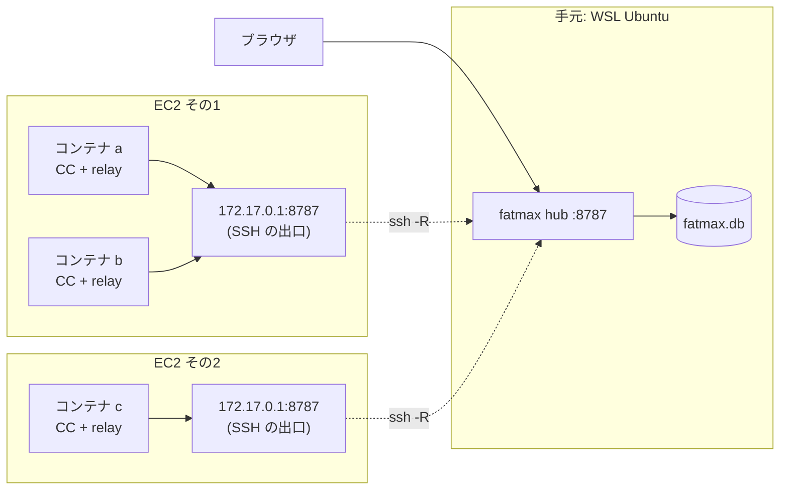

# 複数 EC2 × 複数コンテナ（amd64 / dnf 系）

**手元の Windows（WSL Ubuntu）にハブ**を置き、**複数の EC2 で動いている複数のコンテナ**を
1画面に集める手順です。各コンテナには**中継（リレー）**を入れます。

**CPU は amd64（x86_64）**、コンテナは **dnf 系**（Amazon Linux / Fedora / RHEL）を前提に
書いてあります。いま配っているのは `0.1.17` です。
やめ方は [アンインストール](#アンインストール) にあります。

- コンテナ1つで完結させたい（ハブだけ起動） → **[コンテナ1つで完結](INSTALL-container.md)**
- コンテナを使わない一般的な入れ方 → **[install](INSTALL.md)**

## 前提

**VS Code で、次の2つが繋がって開発できていること。**

1. **Remote-SSH 拡張**で EC2 に入れている
2. その上で **Dev Containers 拡張**でコンテナの中を開けている

Claude Code もそのコンテナの中で動いている状態から始めます。

叩く場所が3つに分かれるので、各手順の頭に書いてあります。

| 場所 | 何をするか |
|---|---|
| **手元の WSL Ubuntu** | ハブを入れて上げる・SSH の設定 |
| **EC2 のホスト**（Remote-SSH で入った先） | sshd の設定・穴が開いたかの確認 |
| **コンテナの中**（Dev Containers で開いた先） | リレー・hook・確認 |

> **VS Code の PORTS では代用できません。** あれは**向こうの口を手元へ持ってくる**向きだけで、
> ここで要るのは逆（**手元のハブを EC2 へ持ち込む**）です。2. の `RemoteForward` がその役です。

---

## 先に、共通のこと

**実行ファイルは1つ**（`fatmax`）で、起動のしかたで役目が決まります。

| 役目 | 起動 | どこに置くか |
|---|---|---|
| **ハブ**（集約して画面を出す） | `fatmax hub` | 手元の WSL Ubuntu に**1つだけ** |
| **リレー**（中継） | `fatmax --hub <URL>` | **コンテナ1つにつき1つ** |

**dnf 系のイメージには `hostname` コマンドが入っていません。** 名前を決めるファイルを置かないと、
画面に出る名前が**空**になります（実測: `amazonlinux:2023`）。**必ず置いてください。**
この1行目が画面に出る名前です。**送るたびに読み直す**ので、書き換えても再起動は要りません。

---



パターン1との違いは2つ。**ハブが別のマシンにいる**ので各コンテナに**リレー**が要ることと、
**EC2 から手元の WSL には届かない**ので SSH で穴を開けることです。

- **コンテナが「1台」の単位**です。`~/.claude` はコンテナごとに別なので、
  1つの EC2 に3コンテナあれば **リレーも3つ**（それぞれのコンテナの中）。
  リレーは自分のコンテナの `~/.claude/projects` を読むので、別コンテナにまとめられません
- リレーの待ち受けは `127.0.0.1:8788`。コンテナごとにネットワーク名前空間が別なので、
  何個あってもぶつかりません
- **ハブの URL を書く場所は、リレーの `--hub` だけ**です。Dockerfile にもイメージにも焼かないこと。
  ハブが引っ越したときに作り直す羽目になります

## 1. 手元の WSL Ubuntu にハブを入れる

**手元の WSL Ubuntu で。**

```sh
curl -fsSL https://nodesi-jp.github.io/fatmax/KEY.gpg | sudo tee /usr/share/keyrings/fatmax.gpg > /dev/null
echo "deb [signed-by=/usr/share/keyrings/fatmax.gpg] https://nodesi-jp.github.io/fatmax stable main" | sudo tee /etc/apt/sources.list.d/fatmax.list
sudo apt update && sudo apt install fatmax
```

署名済みです。

**入れただけでは動きません。** 上げ方は systemd があるかで変わります。

```sh
systemctl is-system-running        # running / degraded なら systemd が使えます
```

`running` か `degraded` なら:

```sh
sudo systemctl enable --now fatmax-hub
```

エラーになる、または `offline` なら **その WSL では systemd が動いていません**。有効にするなら
`/etc/wsl.conf` に次を書いて、Windows 側で `wsl --shutdown` してから開き直します。

```ini
[boot]
systemd=true
```

有効にしないなら、そのまま動かしても構いません。

```sh
nohup fatmax hub > /tmp/fatmax-hub.log 2>&1 &
```

> **記録の置き場が変わります。** systemd（専用ユーザー）なら `/var/lib/fatmax/fatmax.db`、
> 自分で動かしたなら `~/.fatmax/fatmax.db` です。**あとで消すときに効いてきます。**

画面は Windows のブラウザから **`http://localhost:8787/`** です。WSL2 は Windows の localhost を
中の待ち受けへ転送するので、IP を調べる必要はありません。

## 2. 各 EC2 へ、8787 を持ち込む

**手元の WSL Ubuntu で。**（ハブが居るのはここなので、SSH もここから張ります）

`~/.ssh/config`:

```
Host ec2-a
  HostName <EC2 のアドレス>
  User ec2-user
  RemoteForward 172.17.0.1:8787 127.0.0.1:8787
  ServerAliveInterval 30
  ServerAliveCountMax 3
```

**EC2 のホストで**（Remote-SSH で入った先）、`/etc/ssh/sshd_config` に1行足して reload します。

```
GatewayPorts clientspecified
```

```sh
sudo systemctl reload sshd
```

**なぜ `clientspecified` か。** 既定（`no`）では転送先が EC2 の `127.0.0.1` にしか開かず、
**コンテナからは届きません**。`yes` にすると `0.0.0.0`（外向きも含む全部）に開きます。
`clientspecified` なら、上の `RemoteForward` で指定した **docker のブリッジだけ**に開けます。

> **`GatewayPorts yes` にするなら**、`0.0.0.0:8787` が開くことを忘れないでください。
> **fatmax に認証はありません。** EC2 のセキュリティグループが 8787 を通していると、
> **インターネットの誰でも会話の本文を読めます。** 必ず確認してください。
>
> ```sh
> ss -tlnp | grep 8787      # 0.0.0.0:8787 なら外向きにも開いています
> ```

**宛先のアドレスは確かめてください。** 既定のブリッジは `172.17.0.1` ですが、compose が作る
ネットワークは別（`172.18.0.1` など）です。

```sh
docker network inspect bridge -f '{{(index .IPAM.Config 0).Gateway}}'
```

使うネットワークが複数あるなら、`RemoteForward` をその数だけ並べます。
繋いだら、張りっぱなしにします。

```sh
ssh -N ec2-a          # 切れっぱなしが困るなら autossh
```

> **VS Code の接続に兼ねさせることもできます。** Remote-SSH が読むのは
> **Windows 側の `%USERPROFILE%\.ssh\config`** なので、そちらの同じ Host に `RemoteForward`
> を足せば、VS Code が繋いでいる間だけ穴が開き、この `ssh -N` は要らなくなります。
> ただし転送元が **Windows の `127.0.0.1:8787`** になるので、WSL のハブに届くかは
> WSL2 の localhost 転送しだいです。**下の確認が通れば OK**、駄目なら上の `ssh -N`（WSL から）に
> 戻してください。

確認 —— **EC2 のホストで**（Remote-SSH で入った先のターミナル）:

```sh
ss -tlnp | grep 8787                        # 172.17.0.1:8787 で待っている
curl -s http://172.17.0.1:8787/healthz      # ハブが返す
```

## 3. コンテナからハブが見えるようにする

いま穴を開けた `172.17.0.1` を、コンテナから名前で引けるようにします。
`devcontainer.json` に1行足して、**Dev Containers: Rebuild Container**:

```json
"runArgs": ["--add-host=host.docker.internal:host-gateway"]
```

docker compose を使う devcontainer なら、compose 側に書きます。

```yaml
services:
  app:
    extra_hosts:
      - "host.docker.internal:host-gateway"
```

**コンテナを作るときにしか効きません。** 開いたまま足しても反映されないので、
**必ず Rebuild してください。** 確認 —— **コンテナの中で**（VS Code のターミナル）:

```sh
getent hosts host.docker.internal          # アドレスが1行出れば OK
curl -s http://host.docker.internal:8787/healthz
```

## 4. 各コンテナにリレーを置く

**コンテナの中で。** 見たいコンテナそれぞれでやります。

```sh
curl -fsSL https://nodesi-jp.github.io/fatmax/bin/fatmax-linux-x86_64 -o /usr/local/bin/fatmax
chmod +x /usr/local/bin/fatmax
mkdir -p ~/.claude && echo 'ec2-a/api' > ~/.claude/fatmax-host
nohup fatmax --hub http://host.docker.internal:8787 > /tmp/fatmax.log 2>&1 &
```

**`--hub` を書き忘れないでください。** 既定は `http://127.0.0.1:8787`（自分自身）なので、
**何も届かないのに起動だけ成功します**。一番よくある事故です。上げたらログを見ます。

```sh
cat /tmp/fatmax.log       # 「ハブ接続: ✓ つながりました」と、名前が出ます
```

- **`relay` は省けます。** `--hub` を取るのは中継だけなので、役目が一意に決まります
- **名前は全コンテナで別にしてください。** 同じ名前を付けると画面上で1台に混ざり、
  マシン別のコストも合算されます。EC2 の名前と役割を入れておくと、10個あっても迷いません

devcontainer なら、毎回やらなくて済むように入れておきます。

```json
"postStartCommand": "sh -c 'mkdir -p ~/.claude && echo ec2-a/api > ~/.claude/fatmax-host && curl -fsSL https://nodesi-jp.github.io/fatmax/bin/fatmax-linux-x86_64 -o /tmp/fatmax && chmod +x /tmp/fatmax && (nohup /tmp/fatmax --hub http://host.docker.internal:8787 >/tmp/fatmax.log 2>&1 &)'"
```

## 5. 各コンテナに hook を入れる

**コンテナの中で、Claude Code を開いているディレクトリで**実行します。

```sh
curl -fsSL http://host.docker.internal:8787/setup.sh | sh
```

**このあと Claude Code を再起動してください。**
hook の宛先は **127.0.0.1:8788 固定**（同じコンテナの中のリレー）です。
ハブが引っ越しても入れ直しは要りません。直すのはリレーの `--hub` だけです。

## 6. 確認

**コンテナの中で。**

```sh
fatmax status --hub http://host.docker.internal:8787
```

**`--hub` を付けてください。** 付けないと `127.0.0.1:8787`（コンテナの中）を見て `✗` になります
—— ハブが別にあるなら、それが正常な姿です。
最後に、画面にそのコンテナの名前（`ec2-a/api`）が出れば成立です。

## EC2 で気をつけること

- **リレーを落とさないでください。** SSH が切れている間、リレーは**溜めて**おき、
  復帰後に順番どおり送ります（最大 5,000 件）。リレーを置かずに hook 直送にすると、
  **切れている間のイベントは消えます**。回線が切れる前提の EC2 では、リレーは実質必須です
- **EC2 のホスト側には何も置きません。** 入れるのはコンテナの中だけです
- 通信は http で暗号化されません。SSH トンネルの中は SSH が守りますが、
  **EC2 ホスト 〜 コンテナ間は平文**です

---

## トークルームも使う場合（任意）

セッションどうしを会話させるなら、**会話担当エージェント**を入れます。
hook とは別物で、**入れなくても記録は取れます**。

```sh
mkdir -p ~/.claude/agents
curl -fsSL http://host.docker.internal:8787/agents/room-talker.md -o ~/.claude/agents/room-talker.md
```

**宛先は `setup.sh` を叩いたときと同じ**です。入れたら **Claude Code を開き直してください。**

- **部屋に入れるコンテナそれぞれに入れます。** `~/.claude` はコンテナごとに別なので、\n  1つ入れても他のコンテナには効きません。作り直すと消えるため、`postStartCommand` に入れておくと楽です\n- **会話そのものはリレー（`127.0.0.1:8788`）が通します。** 定義が毎回自分で宛先を決めます
- 一覧と Windows 版の入れ方は `http://host.docker.internal:8787/agents` にあります

---

## うまくいかないとき

| 症状 | 見るところ |
|---|---|
| 画面に名前が出ない・空になる | `~/.claude/fatmax-host` が無い。**dnf 系には `hostname` コマンドがありません** |
| 作り直すたびにマシンが増える | 同上。`~/.claude` をマウントするか `postStartCommand` に入れる |
| リレーは動くのに届かない | `--hub` の書き忘れ（既定は自分自身）。`cat /tmp/fatmax.log` の「ハブ接続」 |
| コンテナからハブが見えない | SSH が切れている / `GatewayPorts` / `--add-host`。EC2 上で `ss -tlnp \| grep 8787` |
| 回数とコストが倍 | hook が2箇所（user と project）に入っています。片方を `--uninstall` |
| 実行中に差し込んだ指示が出ない | `fatmax status` の `⚠ ~/.claude/projects が読めません`。リレーを Claude Code と**同じコンテナ・同じユーザー**で動かす |
| 部屋に入れない | そのコンテナに `~/.claude/agents/room-talker.md` がありません（[上](#トークルームも使う場合任意)） |

---

## アンインストール

### コンテナ

**捨てるだけなら何もしなくて構いません**（中にしか置いていないので）。
`~/.claude` をマウントしている・使い続ける場合は:

```sh
curl -fsSL http://host.docker.internal:8787/setup.sh | sh -s -- --uninstall
pkill -f 'fatmax --hub' || true
rm -f /usr/local/bin/fatmax ~/.claude/fatmax-host
```

`--local` で入れたなら、**入れたディレクトリで** `sh -s -- --uninstall --local` です
（外す場所も入れたときと同じ指定で選びます）。fatmax が書いた hook と statusLine
だけを外すので、あなた自身の設定は残ります。

### EC2

**ファイルは1つも置いていません。** 穴を塞ぐだけです。

```sh
sudo sed -i '/^GatewayPorts/d' /etc/ssh/sshd_config    # 足した1行を消す
sudo systemctl reload sshd
```

手元の `~/.ssh/config` からも `RemoteForward` の行を消します。

### WSL Ubuntu（ハブ）

```sh
sudo systemctl disable --now fatmax-hub                # 止めるだけならここまで
sudo apt purge fatmax
sudo rm -f /etc/apt/sources.list.d/fatmax.list /usr/share/keyrings/fatmax.gpg
```

systemd を使わず `nohup` で動かしていたなら、`pkill -f 'fatmax hub'` です。

**記録は消えません。** `purge` でも残します —— 日別の集計を生イベントから積み直しているので、
消すと過去のコストも会話も戻らないためです。消すなら自分で:

```sh
sudo rm -rf /var/lib/fatmax      # systemd（専用ユーザー）で動かしていた場合
rm -rf ~/.fatmax                 # 自分で fatmax hub を動かしていた場合
```

---

[README に戻る](README.md)
