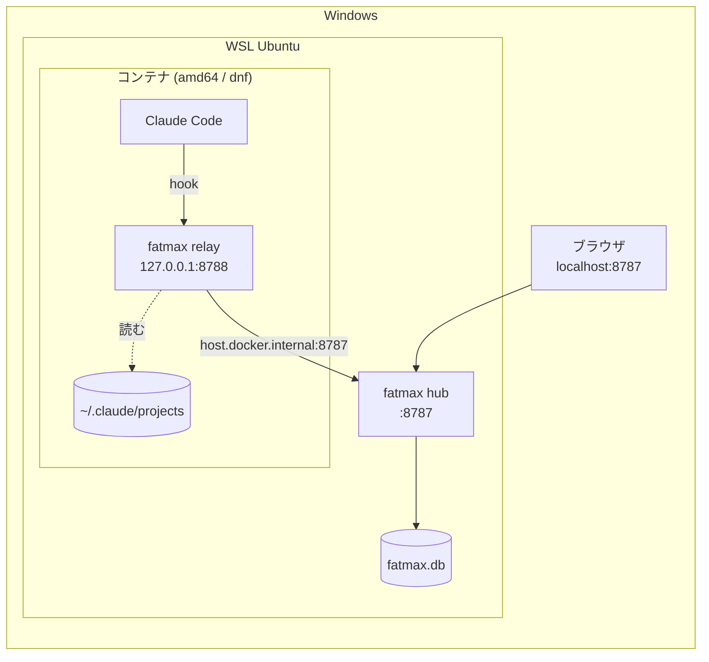
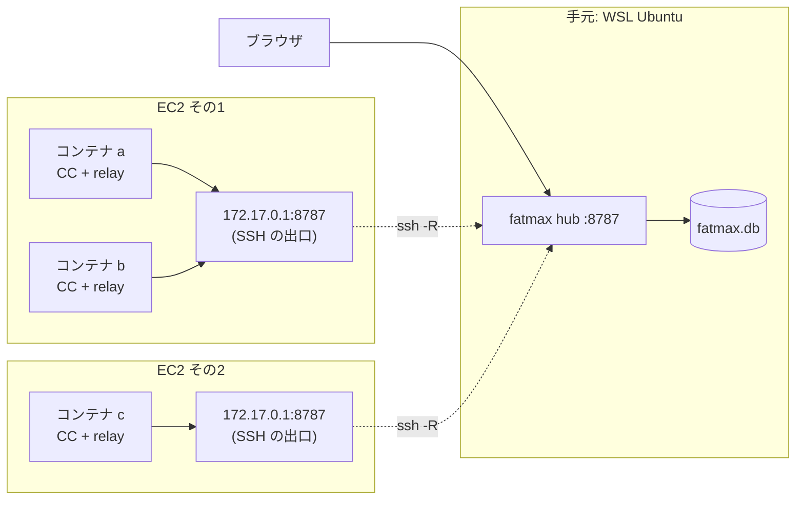

# WSL + Docker（amd64 / dnf 系）の入れ方

Claude Code を **Docker コンテナの中**で動かしていて、画面は **手元の Windows（WSL Ubuntu）**で
見たい人向けの手順です。扱うのは次の2つ。

- **[パターン1](#パターン1-wsl-1台--コンテナ1つ)** — WSL Ubuntu 1台、その上のコンテナ1つ
- **[パターン2](#パターン2-複数-ec2--複数コンテナ)** — WSL Ubuntu にハブ、複数の EC2 でそれぞれ複数コンテナ

どちらも **CPU は amd64（x86_64）**、コンテナは **dnf 系**（Amazon Linux / Fedora / RHEL）を前提に
書いてあります。いま配っているのは `0.1.17` です。
やめ方は [アンインストール](#アンインストール) にあります。

一般的な入れ方（コンテナを使わない場合）は [README](README.md) を見てください。

---

## 先に、共通の考え方

**実行ファイルは1つ**（`fatmax`）で、起動のしかたで役目が決まります。

| 役目 | 起動 | どこに置くか |
|---|---|---|
| **ハブ**（集約して画面を出す） | `fatmax hub` | **1つだけ。** ここでは WSL Ubuntu |
| **リレー**（中継） | `fatmax --hub <URL>` | **Claude Code が動くコンテナ1つにつき1つ** |

- **コンテナが「1台」の単位**です。`~/.claude` も hostname もコンテナごとに別なので、
  1つの EC2 に3コンテナあれば **リレーも3つ**（それぞれのコンテナの中）になります。
  リレーは自分のコンテナの `~/.claude/projects` を読むので、別コンテナにまとめられません
- **リレーは 127.0.0.1:8788 で待ち受けます。** コンテナごとにネットワーク名前空間が別なので、
  何個あってもぶつかりません
- **ハブの URL を書く場所は、リレーの `--hub` だけ**です。Dockerfile にもイメージにも焼かないこと。
  ハブが引っ越したときに作り直す羽目になります
- **`~/.claude/fatmax-host` に名前を必ず置きます。** 置かないと画面にコンテナ ID の16進が並び、
  **コンテナを作り直すたびに別のマシンとして増えます**

---

## パターン1: WSL 1台 + コンテナ1つ



**ハブはコンテナの外（WSL 側）に置きます。** 中に置くと `~/.fatmax/fatmax.db` がコンテナと一緒に
消えるためです。コンテナ1つで完結させたい場合は [下の節](#コンテナ1つで完結させる) を見てください。

### 1. WSL Ubuntu にハブを入れる

```sh
curl -fsSL https://nodesi-jp.github.io/fatmax/KEY.gpg | sudo tee /usr/share/keyrings/fatmax.gpg > /dev/null
echo "deb [signed-by=/usr/share/keyrings/fatmax.gpg] https://nodesi-jp.github.io/fatmax stable main" | sudo tee /etc/apt/sources.list.d/fatmax.list
sudo apt update && sudo apt install fatmax
```

署名済みです。

**入れただけでは動きません。** 上げ方は systemd があるかで変わります。

```sh
systemctl is-system-running        # running / degraded なら systemd が使えます
```

`running` か `degraded` なら:

```sh
sudo systemctl enable --now fatmax-hub
```

エラーになる、または `offline` なら **その WSL では systemd が動いていません**。有効にするなら
`/etc/wsl.conf` に次を書いて、Windows 側で `wsl --shutdown` してから開き直します。

```ini
[boot]
systemd=true
```

有効にしないなら、そのまま動かしても構いません。

```sh
nohup fatmax hub > /tmp/fatmax-hub.log 2>&1 &
```

> **記録の置き場が変わります。** systemd（専用ユーザー）なら `/var/lib/fatmax/fatmax.db`、
> 自分で動かしたなら `~/.fatmax/fatmax.db` です。**あとで消すときに効いてきます。**

### 2. 画面を開く

Windows のブラウザから **`http://localhost:8787/`** です。WSL2 は Windows の localhost を
中の待ち受けへ転送するので、IP を調べる必要はありません。

### 3. コンテナからハブが見えるようにする

コンテナを作るときに、ホストの名前を引けるようにします。

```sh
docker run --add-host=host.docker.internal:host-gateway ...
```

compose なら:

```yaml
services:
  app:
    extra_hosts:
      - "host.docker.internal:host-gateway"
```

devcontainer.json なら:

```json
"runArgs": ["--add-host=host.docker.internal:host-gateway"]
```

**コンテナを作るときにしか効きません。** すでに動いているものは作り直してください
（VS Code なら Dev Containers: Rebuild Container）。

確認 —— コンテナの中で:

```sh
getent hosts host.docker.internal          # アドレスが1行出れば OK
curl -s http://host.docker.internal:8787/healthz
```

<details>
<summary>2行目が返らないとき（Docker Desktop を使っている場合）</summary>

**Docker Desktop の `host.docker.internal` は Windows ホストを指します。** ハブは WSL
ディストロの中にいるので、そこには届きません。WSL の IP を直接使ってください。

```sh
hostname -I | awk '{print $1}'      # ← WSL 側で実行。172.x.x.x が出ます
```

以降の手順の `host.docker.internal` を、その IP に読み替えます。
**WSL の IP は再起動で変わります**（変わったらリレーの `--hub` を直します）。

WSL の中に docker engine を入れている場合は `host-gateway` が WSL 自身を指すので、
読み替えは要りません。
</details>

### 4. コンテナにリレーを置く

```sh
curl -fsSL https://nodesi-jp.github.io/fatmax/bin/fatmax-linux-x86_64 -o /usr/local/bin/fatmax
chmod +x /usr/local/bin/fatmax
mkdir -p ~/.claude && echo 'dev-1' > ~/.claude/fatmax-host
nohup fatmax --hub http://host.docker.internal:8787 > /tmp/fatmax.log 2>&1 &
```

**`--hub` を書き忘れないでください。** 既定は `http://127.0.0.1:8787`（自分自身）なので、
**何も届かないのに起動だけ成功します**。一番よくある事故です。上げたらログを見ます。

```sh
cat /tmp/fatmax.log       # 「ハブ接続: ✓ つながりました」と、名前が出ます
```

- **`relay` は省けます。** `--hub` を取るのは中継だけなので、役目が一意に決まります
- dnf 系には **curl も python3 も最初から入っています**（dnf 自身が python3 なので）。
  実測: `amazonlinux:2023`（amd64）は python3 3.9 / curl 8.17。jq はありませんが要りません
- `~/.claude/fatmax-host` の名前は **送るたびに読み直します**。書き換えても再起動は不要です

devcontainer なら、毎回やらなくて済むように入れておきます。

```json
"postStartCommand": "sh -c 'mkdir -p ~/.claude && echo dev-1 > ~/.claude/fatmax-host && curl -fsSL https://nodesi-jp.github.io/fatmax/bin/fatmax-linux-x86_64 -o /tmp/fatmax && chmod +x /tmp/fatmax && (nohup /tmp/fatmax --hub http://host.docker.internal:8787 >/tmp/fatmax.log 2>&1 &)'"
```

> **`postCreateCommand` ではなく `postStartCommand`。** postCreate は作った1回だけなので、
> コンテナを止めて開き直すとリレーが上がりません。

### 5. コンテナに hook を入れる

**Claude Code を開いているディレクトリで**実行します。

```sh
curl -fsSL http://host.docker.internal:8787/setup.sh | sh
```

`~/.claude/settings.json` に hook と statusLine が入るだけで、置くファイルはありません。
**このあと Claude Code を再起動してください。**

- 既定は `--user`（そのコンテナの全プロジェクト）です。1つのプロジェクトに絞るなら、
  そのディレクトリで `sh -s -- --local`。**書き先が `$PWD/.claude/settings.local.json` なので、
  場所を間違えると「インストールしました」と出たまま1件も届きません**
- hook の宛先は **127.0.0.1:8788 固定**（同じコンテナの中のリレー）です。
  ハブが引っ越しても入れ直しは要りません。直すのはリレーの `--hub` だけです
- **2箇所に入れないこと。** user と project の両方にあると足し算で読まれ、
  **全イベントが2回届いて回数もコストも倍**になります

### 6. 確認

```sh
fatmax status --hub http://host.docker.internal:8787
```

**`--hub` を付けてください。** 付けないと `127.0.0.1:8787`（コンテナの中）を見て `✗` になります
—— ハブが別にあるなら、それが正常な姿です。

最後に、画面にそのコンテナの名前（`dev-1`）が出れば成立です。

### コンテナを作り直したとき

`/usr/local/bin/fatmax` も `/tmp` も消えるので、**4. と 5. をやり直します**
（`postStartCommand` に入れてあるなら自動です）。`~/.claude` をマウントしておくと、
名前と hook は残ります。

### コンテナ1つで完結させる

「記録が消えても構わない」なら、**コンテナの中でハブを動かすほうが簡単**です。
リレーも `--add-host` も要りません。

```sh
curl -fsSL https://nodesi-jp.github.io/fatmax/bin/fatmax-linux-x86_64 -o /usr/local/bin/fatmax
chmod +x /usr/local/bin/fatmax
nohup fatmax hub > /tmp/fatmax-hub.log 2>&1 &
curl -fsSL http://127.0.0.1:8787/setup.sh | sh
```

画面を見るには **8787 をホストへ出します**（`docker run -p 8787:8787`、devcontainer なら
PORTS タブ）。記録は `~/.fatmax/fatmax.db` で、**コンテナを作り直すと消えます**。
残すならマウント先を指してください（`fatmax hub --db /workspaces/.fatmax/fatmax.db`）。

---

## パターン2: 複数 EC2 × 複数コンテナ



コンテナの中でやることは **パターン1とまったく同じ**です。違うのは1点だけ ——
**EC2 から手元の WSL には届かない**ので、SSH で穴を開けます。

### 1. ハブ

パターン1の [1.](#1-wsl-ubuntu-にハブを入れる) と同じです。手元の WSL Ubuntu に入れて上げます。

### 2. 各 EC2 へ、8787 を持ち込む

**ハブの居る WSL から** EC2 へ SSH します。`~/.ssh/config`:

```
Host ec2-a
  HostName <EC2 のアドレス>
  User ec2-user
  RemoteForward 172.17.0.1:8787 127.0.0.1:8787
  ServerAliveInterval 30
  ServerAliveCountMax 3
```

EC2 側の `/etc/ssh/sshd_config` に1行足して、reload します。

```
GatewayPorts clientspecified
```

```sh
sudo systemctl reload sshd
```

**なぜ `clientspecified` か。** 既定（`no`）では転送先が EC2 の `127.0.0.1` にしか開かず、
**コンテナからは届きません**。`yes` にすると `0.0.0.0`（外向きも含む全部）に開きます。
`clientspecified` なら、上の `RemoteForward` で指定した **docker のブリッジだけ**に開けます。

> **`GatewayPorts yes` にするなら**、`0.0.0.0:8787` が開くことを忘れないでください。
> **fatmax に認証はありません。** EC2 のセキュリティグループが 8787 を通していると、
> **インターネットの誰でも会話の本文を読めます。** 必ず確認してください。
>
> ```sh
> ss -tlnp | grep 8787      # 0.0.0.0:8787 なら外向きにも開いています
> ```

**宛先のアドレスは確かめてください。** 既定のブリッジは `172.17.0.1` ですが、compose が作る
ネットワークは別（`172.18.0.1` など）です。

```sh
docker network inspect bridge -f '{{(index .IPAM.Config 0).Gateway}}'
```

使うネットワークが複数あるなら、`RemoteForward` をその数だけ並べます。

繋いで、張りっぱなしにします。

```sh
ssh -N ec2-a          # 切れっぱなしが困るなら autossh
```

確認 —— EC2 の上で:

```sh
ss -tlnp | grep 8787                        # 172.17.0.1:8787 で待っている
curl -s http://172.17.0.1:8787/healthz      # ハブが返す
```

### 3. 各コンテナ

パターン1の [3.](#3-コンテナからハブが見えるようにする) 〜 [6.](#6-確認) をそのままやります
（`--add-host=host.docker.internal:host-gateway` が、いま穴を開けた `172.17.0.1` を指します）。

**名前だけは全コンテナで別にしてください。**

```sh
echo 'ec2-a/api' > ~/.claude/fatmax-host
```

同じ名前を付けると画面上で1台に混ざり、マシン別のコストも合算されます。
EC2 の名前と役割を入れておくと、10個あっても迷いません。

### 4. EC2 で気をつけること

- **リレーを落とさないでください。** SSH が切れている間、リレーは**溜めて**おき、
  復帰後に順番どおり送ります（最大 5,000 件）。リレーを置かずに hook 直送にすると、
  **切れている間のイベントは消えます**。回線が切れる前提の EC2 では、リレーは実質必須です
- **EC2 のホスト側には何も置きません。** 入れるのはコンテナの中だけです
- 通信は http で暗号化されません。SSH トンネルの中は SSH が守りますが、
  **EC2 ホスト 〜 コンテナ間は平文**です

---

## うまくいかないとき

| 症状 | 見るところ |
|---|---|
| 画面に何も出ない | コンテナで `fatmax status --hub http://host.docker.internal:8787` |
| 名前が謎の16進 | `~/.claude/fatmax-host` が無い。書けば次のイベントから変わります |
| 作り直すたびにマシンが増える | 同上。`~/.claude` をマウントするか `postStartCommand` に入れる |
| 回数とコストが倍 | hook が2箇所（user と project）に入っています。片方を `--uninstall` |
| 実行中に差し込んだ指示が出ない | `fatmax status` の `⚠ ~/.claude/projects が読めません`。リレーを Claude Code と**同じコンテナ・同じユーザー**で動かしてください |
| リレーは動くのに届かない | `--hub` の書き忘れ（既定は自分自身）。`cat /tmp/fatmax.log` の「ハブ接続」 |

---

## アンインストール

### コンテナ

**捨てるだけなら何もしなくて構いません**（中にしか置いていないので）。
`~/.claude` をマウントしている・使い続ける場合は:

```sh
curl -fsSL http://host.docker.internal:8787/setup.sh | sh -s -- --uninstall
pkill -f 'fatmax --hub' || true
rm -f /usr/local/bin/fatmax ~/.claude/fatmax-host
```

`--local` で入れたなら、**入れたディレクトリで** `sh -s -- --uninstall --local` です
（外す場所も入れたときと同じ指定で選びます）。fatmax が書いた hook と statusLine
だけを外すので、あなた自身の設定は残ります。

### EC2

**ファイルは1つも置いていません。** 穴を塞ぐだけです。

```sh
sudo sed -i '/^GatewayPorts/d' /etc/ssh/sshd_config    # 足した1行を消す
sudo systemctl reload sshd
```

手元の `~/.ssh/config` からも `RemoteForward` の行を消します。

### WSL Ubuntu（ハブ）

```sh
sudo systemctl disable --now fatmax-hub                # 止めるだけならここまで
sudo apt purge fatmax
sudo rm -f /etc/apt/sources.list.d/fatmax.list /usr/share/keyrings/fatmax.gpg
```

systemd を使わず `nohup` で動かしていたなら、`pkill -f 'fatmax hub'` です。

**記録は消えません。** `purge` でも残します —— 日別の集計を生イベントから積み直しているので、
消すと過去のコストも会話も戻らないためです。消すなら自分で:

```sh
sudo rm -rf /var/lib/fatmax      # systemd（専用ユーザー）で動かしていた場合
rm -rf ~/.fatmax                 # 自分で fatmax hub を動かしていた場合
```

---

[README に戻る](README.md)
