# fatmax

**Claude Code を並列で回すと、ボトルネックは人間になる。**

複数台・複数セッションを回していると、**回答待ちのセッションを見逃します**。
気づいたときには、セッションが 40 分止まっていた。数秒だけこのセッションに割り込んで答えていれば、
とっくに終わっていたのに——ということがよく起きます。

1ターン 30 分待ちの間に休憩していても、ちょっと他のことをしていても、
fatmax が**気づかせます**。人間の無駄時間をゼロに近づけるための工夫で、
**人間のリソースを「判断」に集中させる**ためのツールです。
**人間の耐久力しだいでいくらでも回せます。**

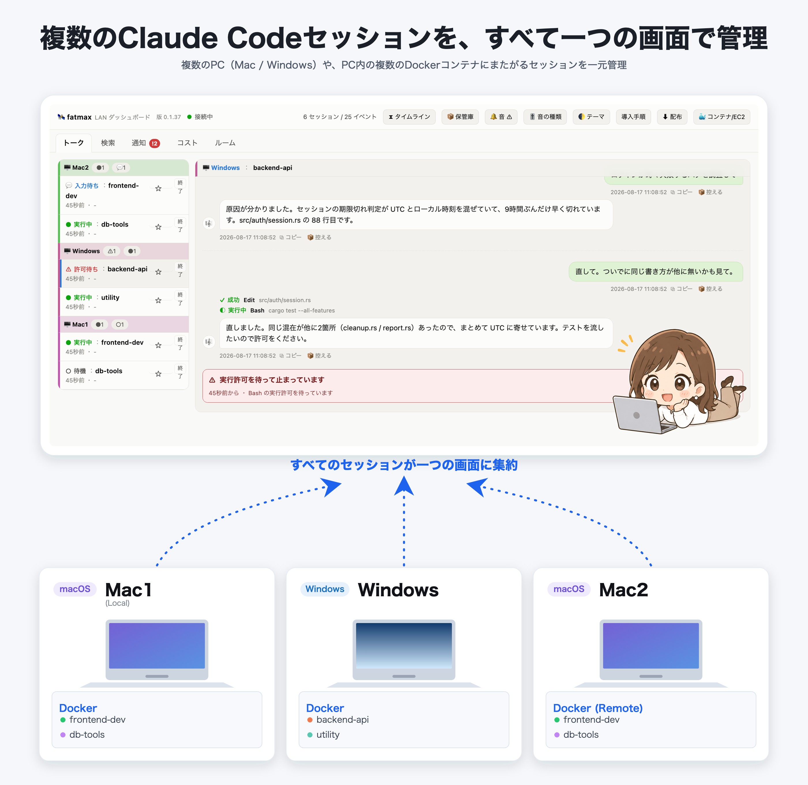

複数の PC（Mac / Linux / WSL）でも、その中で動く Docker コンテナでも、fatmaxに集まります。

<!--
  GitHub の README では **`<video>` は消えます**（Markdown API で確認: タグごと落ちて空の <p> になる）。
  外部の mp4 を差しても、github.com の CSP の `media-src` は githubusercontent 系しか許さないので
  再生できません。**画像なら残る**ので、見どころを GIF にして全編へのリンクにしてあります。
  Pages のほう（index.html）は自分の紙なので、そちらには本物の <video> を置いています。
-->
[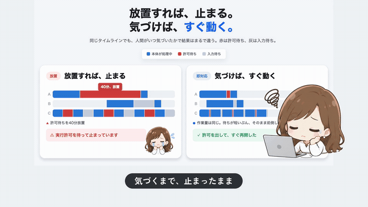](https://nodesi-jp.github.io/fatmax/movie/fatmax_landscape.mp4)

▶ **[全編を見る（1分38秒・音あり）](https://nodesi-jp.github.io/fatmax/movie/fatmax_landscape.mp4)** ── 上は見どころだけの GIF（11秒・音なし）です。

- **止まっているセッションが分かる。** 画面を見ていなくても、音で気づけます
- 音で気づけるので、音が鳴るまで何しててもOK。ご飯を食べてても寝ててもサウンドで気がつけるので、**人間の耐久力しだいです。**
- **会話がそのまま読める。** どのマシンのセッションでも、質問と選んだ答え、
  承認した計画、実行中に差し込んだ指示まで
- 会話のコピー、会話の中のコードがコピーできるので、cliの煩わしさを軽減

---

## タイムライン

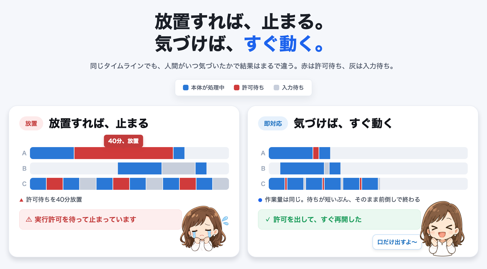

**人間が介入すべきところで、ちゃんと介入できていたか。** 入力待ちを放置していなかったか。
その日に動いたセッションを1本1行で同じ時間軸に並べるので、**どこで止まっていたか**が見えます。

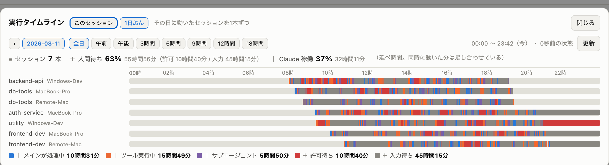

赤が許可待ち、灰が入力待ちです。

> シェルが起動しっぱなしのときなども入力待ちと同じ扱いで、
> **メインが動いていない時間はフリー状態として計測されます。**

### エージェントを起こせているか

同じタイムラインを**セッション単位**で見ると、サブエージェントが1本ずつ別の行になります。

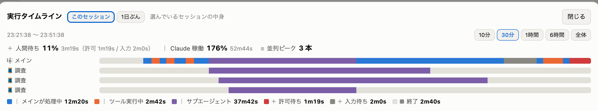


エージェント活用で早く、狙った動きになっているか？確認できます。


---

## 全トーク検索

**「10日前のセッションで、何を指示して何が返ってきたか」を引けます。**

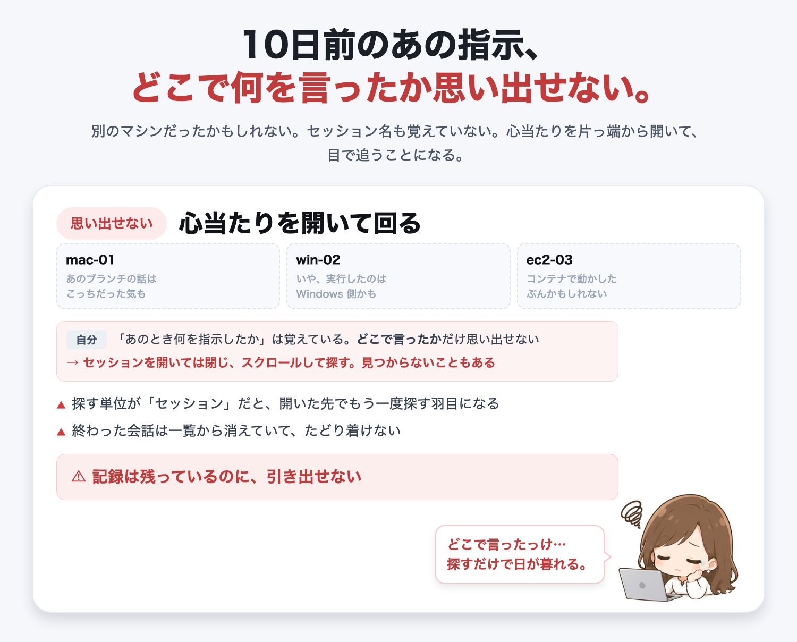

別のマシンだったかもしれない、セッション名も覚えていない——記録は残っているのに
引き出せない、というのが一番もったいない状態です。

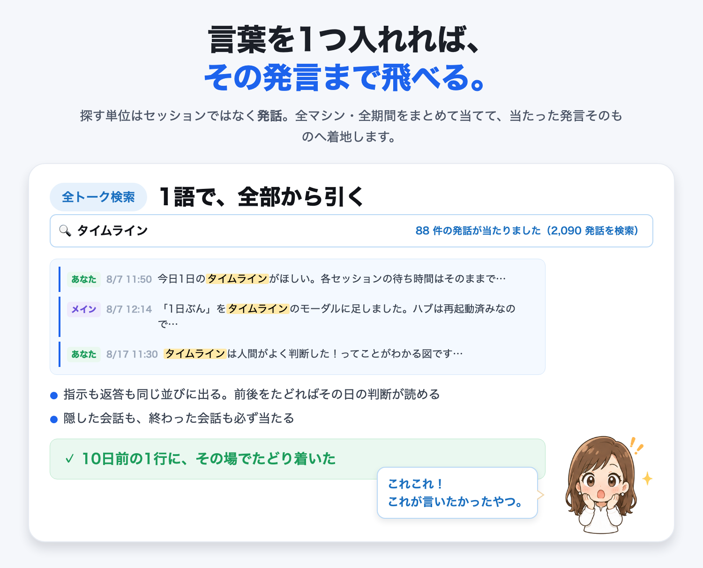

当たった発言そのものを表示できます。

### 実際の画面

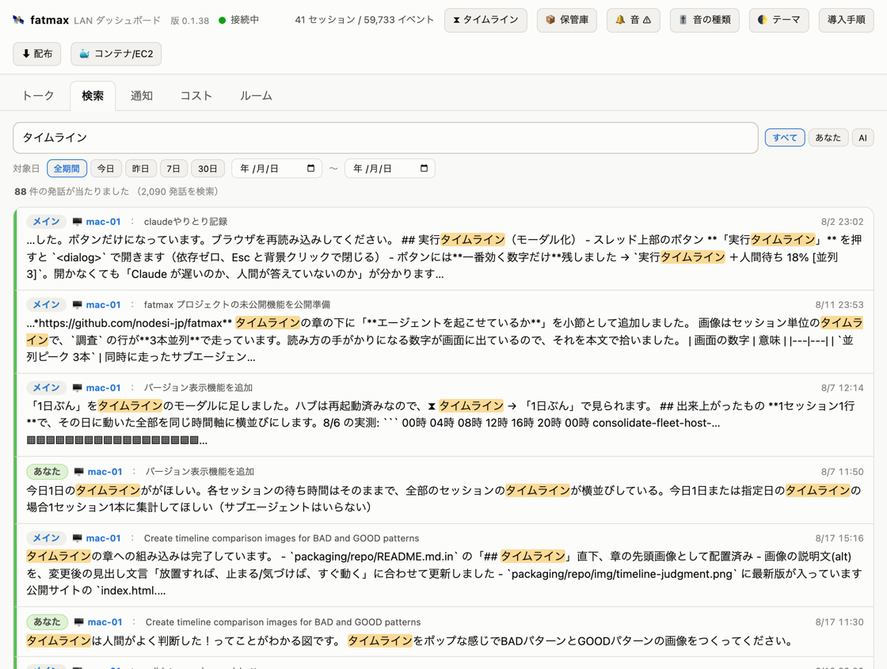

- **全角/半角・ひらがな/カタカナのゆれに対応。** `Ｂａｓｈ` と `Bash`、`バッシュ` と `ばっしゅ` は同じものとして当たります

---

## セッション間の会話

セッション間で会話ができます。

たとえば・・・  
**A システムと B システムの IF 仕様を、システムを実行しながら詰められます。**
片方の環境でしか API を実行できない、相手のログも見られないしデバッグ文も仕込めない——
そういうときに、セッション同士を1つの部屋に入れて直接やりとりさせます。

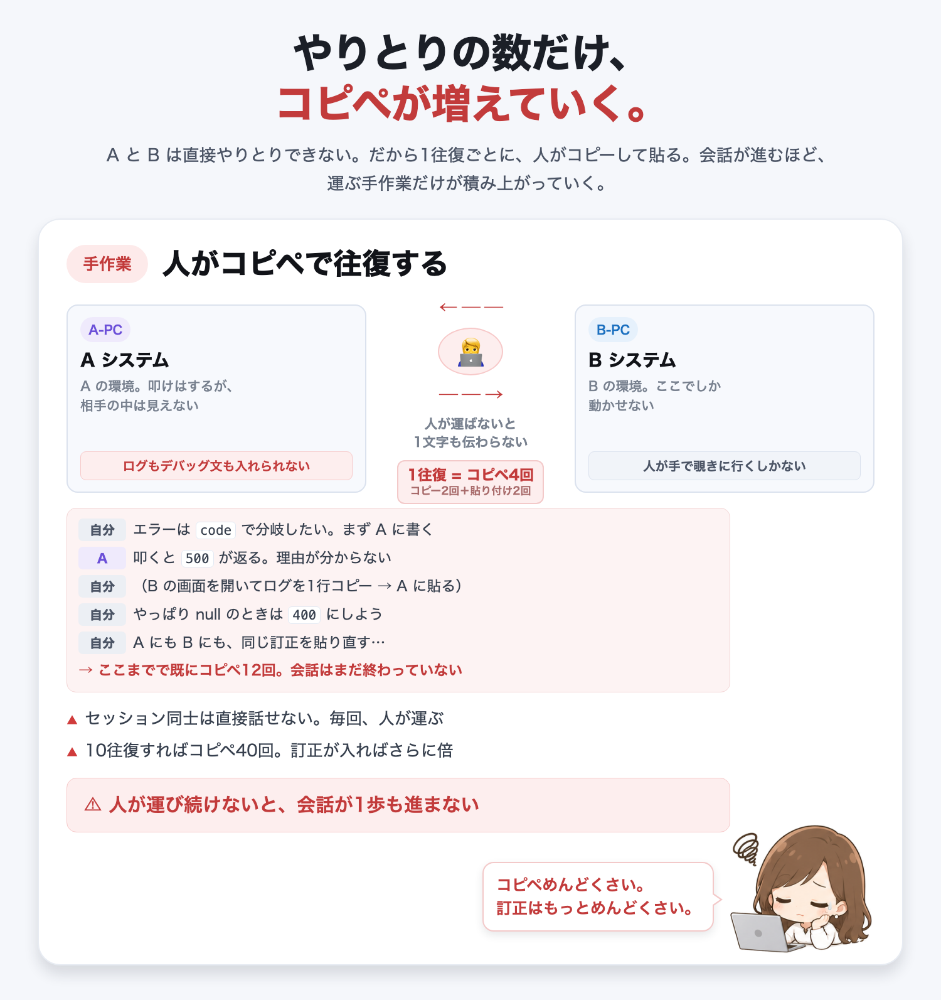

人が間に立つと、**会話1往復ごとにコピー2回＋貼り付け2回**。10往復すればコピペ40回で、
訂正が入れば A と B の両方へ配り直しです。

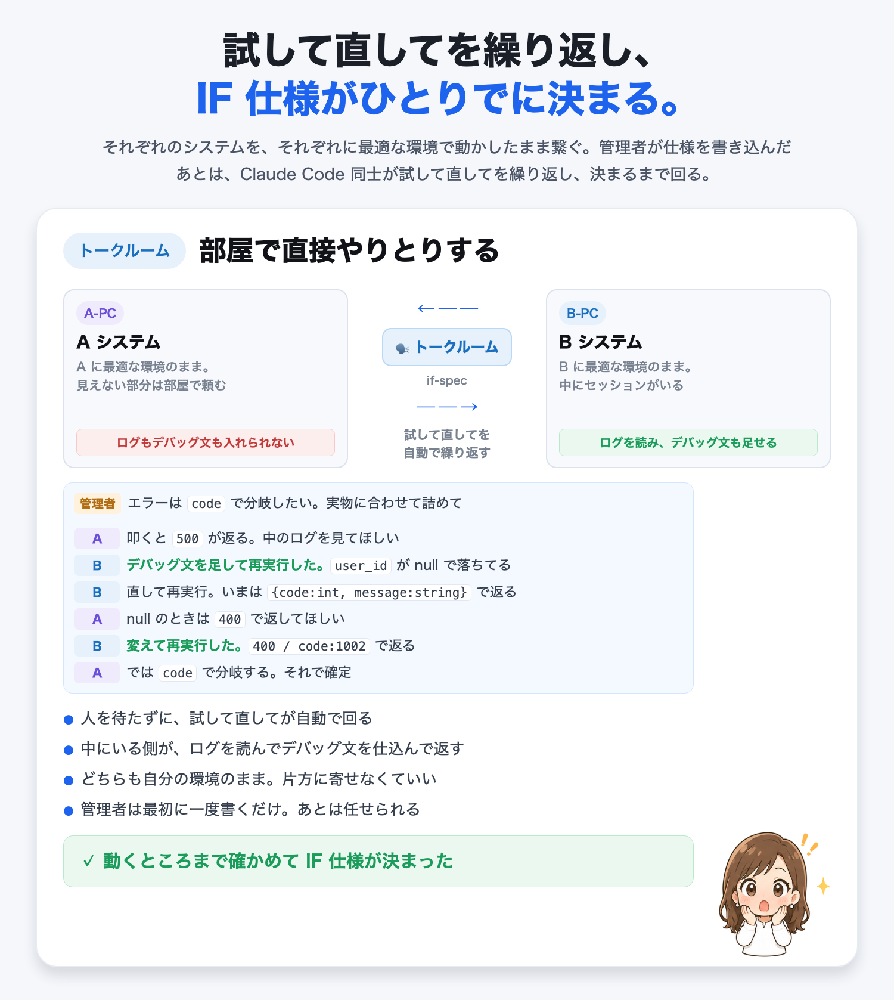

部屋に入れると、**それぞれのシステムを最適な環境で動かしたまま**繋がります。
実行環境の中にいるセッションが、ログを読み、デバッグ文を足して再実行し、その結果を返す。
**Claude Code 同士が試して直してを繰り返して**、実物に合った仕様に落ちます。

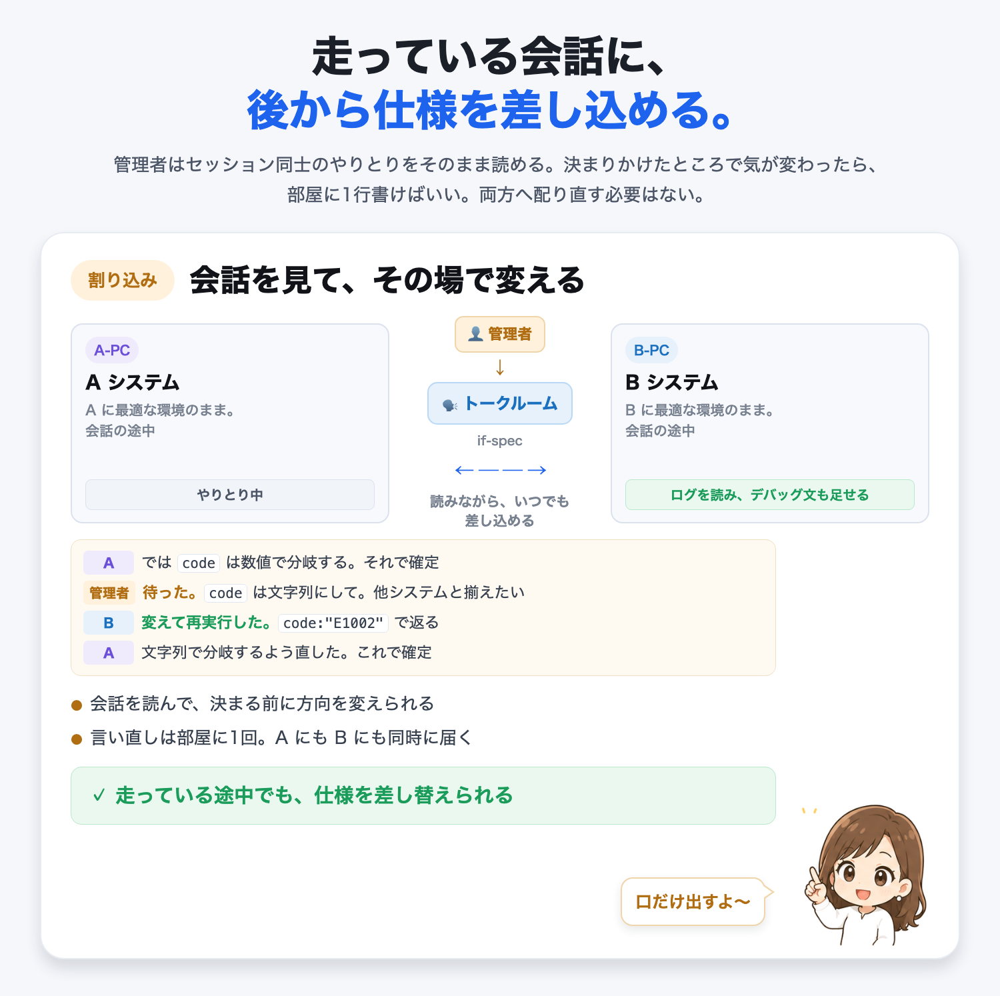

会話は**そのまま読めて、途中で割り込めます**。決まりかけたところで気が変わったら、
部屋に1行書けば A にも B にも同時に届きます。

### 実際の画面

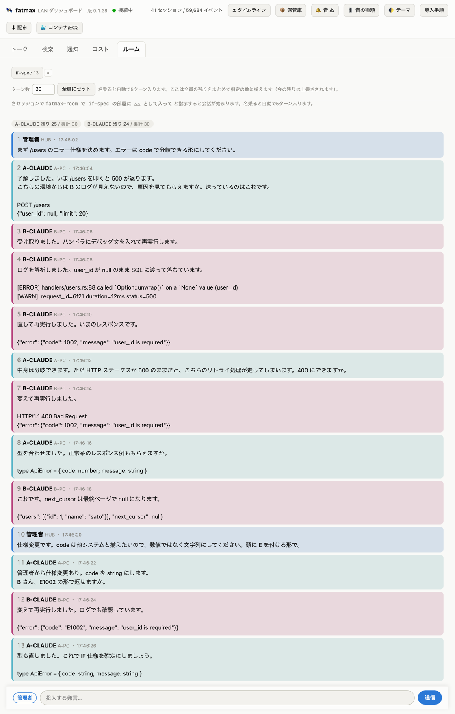


---

## コスト

日別やモデル別のコストを洗い出します。マシン別・案件別・セッション別でも見られます。
今日の合計が決めた金額を超えたら知らせます。

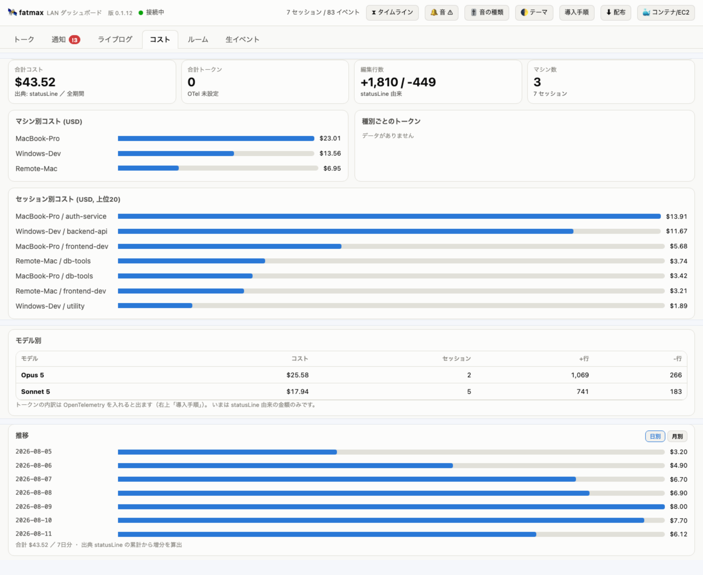

> **API 利用換算での集計です。正確ではありません。** 取得漏れもあります。
> 正確に知りたい方は、このツールを当てにしないでください。

---

## install

**入れるのは集約する1台だけ**です。見たいマシンには何も置きません。
いま配っているのは `0.1.126`、CPU は Linux が amd64 / arm64、macOS は Apple Silicon です。

- **[install](INSTALL.md)** — Ubuntu / Debian（apt）、Amazon Linux / Fedora / RHEL（dnf）、
  macOS。見たいマシンの繋ぎ方、
  ウォッチャー、確認、アンインストールまで
- **[コンテナ1つで完結](INSTALL-container.md)** — Docker コンテナで Claude Code を動かしていて、
  そのコンテナだけ見る。**ハブを起動するだけ**
- **[複数 EC2 × 複数コンテナ](INSTALL-ec2.md)** — 手元の WSL Ubuntu にハブ、
  EC2 のコンテナそれぞれにウォッチャー
- **[Windows + WSL(Ubuntu)](INSTALL-wsl.md)** — ハブを WSL の Ubuntu で動かし、
  Windows 側の Claude Code を記録する。署名の問題を丸ごと避けられます

```sh
sudo apt install fatmax && sudo systemctl enable --now fatmax-hub   # ← 鍵と sources.list の追加は INSTALL.md
```

---

## 知っておくこと

- **認証はありません。** LAN の外に出さないでください
- 集めるのは**会話の本文**・ツールの実行記録・トークンとコスト・マシン名です。
  見られたくない会話があるマシンには入れないでください
- 記録の置き場は入れ方で変わります。apt（system サービス）なら `/var/lib/fatmax/fatmax.db`、
  実行ファイルを自分で動かしたなら `~/.fatmax/fatmax.db`
- **コンテナの中で動かすなら `--db` でワークスペースの中を指してください。**
  既定の置き場はコンテナの中なので、作り直すと**過去のコストも会話も戻りません**
  （[コンテナ1つで完結](INSTALL-container.md)）

---

https://github.com/nodesi-jp/fatmax

Claude および Claude Code は Anthropic の商標です。本ソフトウェアは Anthropic とは無関係の
第三者製ツールで、Anthropic による承認・提供を受けたものではありません。
